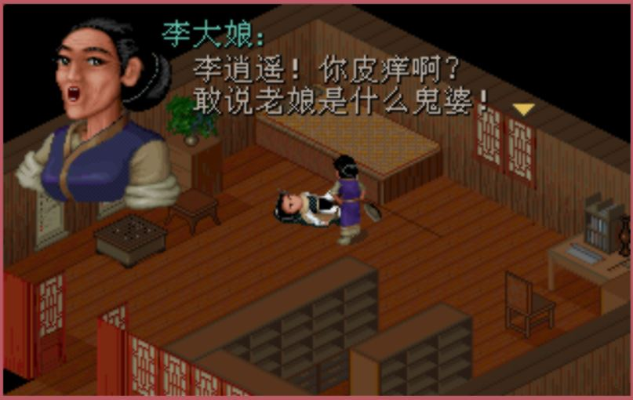
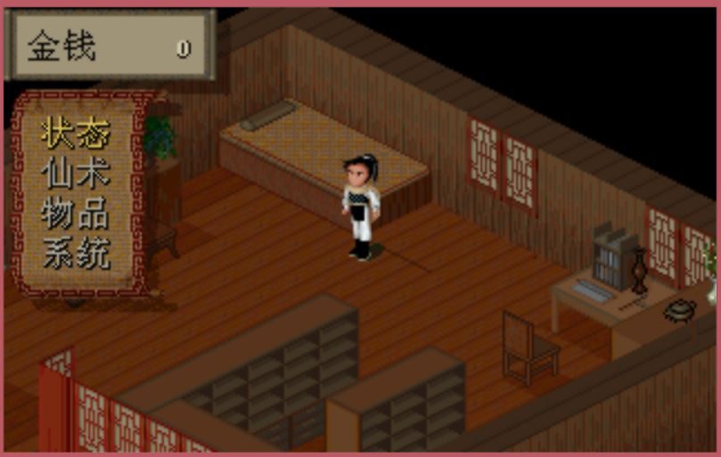

# 《仙剑奇侠传DOS版》

####简介
1995年7月10日出品（故常被称作“仙剑95版”），由大宇资讯狂徒创作群制作，是影响了整整一代玩家的游戏大作。发布有磁盘版和光盘版，但由于磁盘容量不足，因此有进行删减。本作自面世以来就长盛不衰，在游戏史上以惊人的生命力屹立十多年不倒。感人的剧情、动情的音乐、还有那优雅的诗词至今仍让老一辈的玩家难以忘怀。游戏的主角李逍遥、赵灵儿、林月如、阿奴，也成了游戏界的明星人物。游戏的总策划兼编剧姚壮宪也被誉为“仙剑之父”。美中不足的是，最初的DOS版游戏中法术、道具等缺乏说明。虽然有人认为《仙剑奇侠传》的巨大成功在后来客观上阻碍了其他国产游戏的创新和发展，但毫无疑问的是，《仙剑奇侠传》是中国游戏史上一座重要的里程碑。

####支持平台
- Windows XP、Windows 7、Windows 8、Windows 10

####使用
```shell
git clone https://github.com/handoing/Legend-of-Sword-and-Fairy
./dosbox -conf jianti.conf // 简体版
./dosbox -conf fanti.conf // 繁体版
```
也可通过双击./dos_cn.bat或./dos_tc.bat来启动程序。

####配置
配置文件为jianti.conf和fanti.conf，可自行配置。
```shell
[sdl]
# fullscreen -- Start dosbox directly in fullscreen.
# fulldouble -- Use double buffering in fullscreen.
# fullfixed -- Don't resize the screen when in fullscreen.
# fullresolution -- What resolution to use for fullscreen, use together with fullfixed.
# output -- What to use for output: surface,overlay,opengl,openglnb,ddraw.
# hwscale -- Extra scaling of window if the output device supports hardware scaling.
# autolock -- Mouse will automatically lock, if you click on the screen.
# sensitiviy -- Mouse sensitivity.
# waitonerror -- Wait before closing the console if dosbox has an error.
# priority -- Priority levels for dosbox: lower,normal,higher,highest.
#             Second entry behind the comma is for when dosbox is not focused/minimized.
# mapperfile -- File used to load/save the key/event mappings from.

fullscreen=false
fulldouble=false
fullfixed=true
fullresolution=640x480
......
```

####截图



